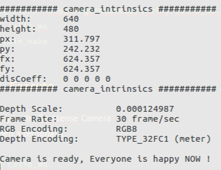

# Robotic Hand-eye Calibration with Depth Camera Using Sphere-Model
This repository is the backup for my part @  ** *JingDong GRASPING ROBOT CHALLENGE* **
Also the implements of my paper: ** *Robotic hand-eye calibration with depth camera: A sphere model approach* **

| **`Ubuntu 1604 & ROS Kinetic Kame`** |
## Related Publications:    

Yang, Lixin, et al. " **Robotic hand-eye calibration with depth camera: A sphere model approach.** " 2018 4th International Conference on Control, Automation and Robotics (ICCAR). IEEE, 2018. **[PDF](https://ieeexplore.ieee.org/document/8384652/)**

    @inproceedings{yang2018robotic,
      title={Robotic hand-eye calibration with depth camera: A sphere model approach},
      author={Yang, Lixin and Cao, Qixin and Lin, Minjie and Zhang, Haoruo and Ma, Zhuoming},
      booktitle={2018 4th International Conference on Control, Automation and Robotics (ICCAR)},
      pages={104--110},
      year={2018},
      organization={IEEE}
    }
## License
handeyeCalibWithDepthCamera is freely available for free non-commercial use, and may be redistributed under these conditions. Please, see the [license](LICENSE) for further details

## Prerequisit
* **Ubuntu 16.04** 
* **ROS Kinetic Kame**  // full install   
* **PCL 1.7+** (should be included in ROS Kinetic Kame)
* **OpenCV 3.3** (should be included in ROS Kinetic Kame)
* **cv_bridge**
`sudo apt-get install ros-kinetic-cv-bridge`
* **Eigen3**  (should be included in Ubutnu 16.04)  
`sudo apt-get install libeigen3-dev`
* **Sophus** (https://github.com/stonier/sophus)  // standard make and make install
* **Ceres** (http://ceres-solver.org/) // follow the installation guild
* **librealsense2** (https://github.com/IntelRealSense/librealsense) :  
We use the `librealsense2` version to drive Intel RealSense ZR300 Camera. and wrap it by ROS topics and services. Our `realsense2_driver` need the `librealsense2.so`. The recommended way to install it is by following the Linux guide:(https://github.com/IntelRealSense/librealsense/blob/master/doc/distribution_linux.md) 
, or as below:   
```Shell
sudo apt-key adv --keyserver keys.gnupg.net --recv-key C8B3A55A6F3EFCDE \
		|| sudo apt-key adv --keyserver hkp://keyserver.ubuntu.com:80 --recv-key C8B3A55A6F3EFCDE
sudo add-apt-repository \ 
		"deb http://realsense-hw-public.s3.amazonaws.com/Debian/apt-repo xenial main" -u
sudo apt-get update
sudo apt-get install librealsense2-dev
```

## Compile  `calib_ws`
Standard ROS workspace `catkin_make` procedure; 
```Shell
cd ~/WhereEver_You_Want
git clone https://github.com/lixiny/calib_ws.git 
cd calib_ws	
catkin_make
```

## Usage

#### 1.  Plug-In the Realsense Camera  & Open a Terminal 1: 
```Shell
cd calib_ws
source devel/setup.bash
roslaunch realsense2_driver realsense_driver.launch
```
when it shows the INFO like:   
<div align="center">
	 
</div>

means the realsense2_driver is successfully tuned up. 

**Important**:  you should use the pop-up parameters:  **`###### camera_intrinsics ######`**  to update:
  `./calib_ws/src/handeye_calib_sphere/camera_intrinsic_color.xml` .
  
After `roslaunch`, you should have topics as blow in your terminal when you run:  `rostopic list`

#### 2. Prepare the Calibration Set-ups :
##### 2.1 A Shpere Model:
we use a 3D-printed hollow sphere model with Radius 75mm ( you can modify this radius if necessary).

##### 2.2 An Aruco Plate (not compulsory ):
we use RANSAC to localize the sphere inside the captured pointclouds.  instead to iterate from a full bunch of scatted points,  if we can use a aruco plate to segmente a region and make sure the points inside the region are all captured **on** the sphere,  RANSAC would be much easier( it should be ). 

The Aruco Plate is not compulsory again, you can de-activate the aruco module as described in `Advanced Usage` part.  

We use the aruco plate with 2 different size:


##### 2.3 Eye-in-hand Camera Mounting:
Till now, we only implement the eye-in-hand configration.  If you are familiar with the hand-eye problem, you can easily implement the eye-to-hand yourself.  
We use the hand-mounted camera viewing the Sphere-ArucoPlate setups as shown below. 
[这里添一张图片]
 
##### 2.4 Gave a Initial Value

#### 3.  Tune up Robot, record the TFlink name of `base_link` and `end_link`  

we use UR5 and self-defined   [我还没写完]

#### 5.  Open another termianl 2:
```
cd calib_ws
source devel/setup.bash
## 开始采集数据: 

```