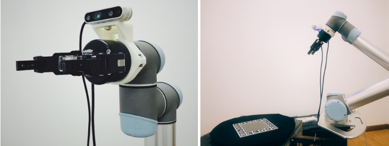
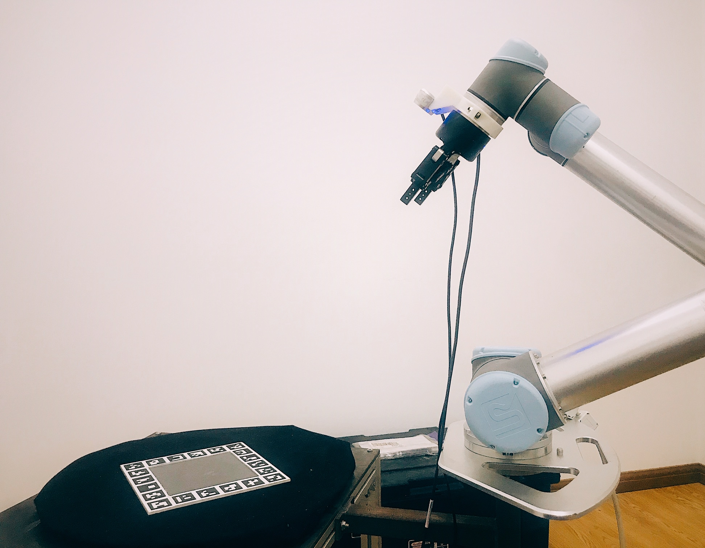
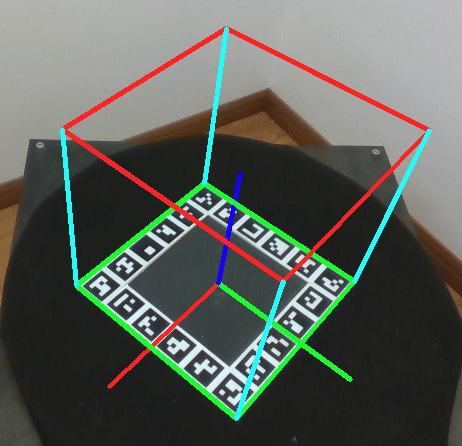
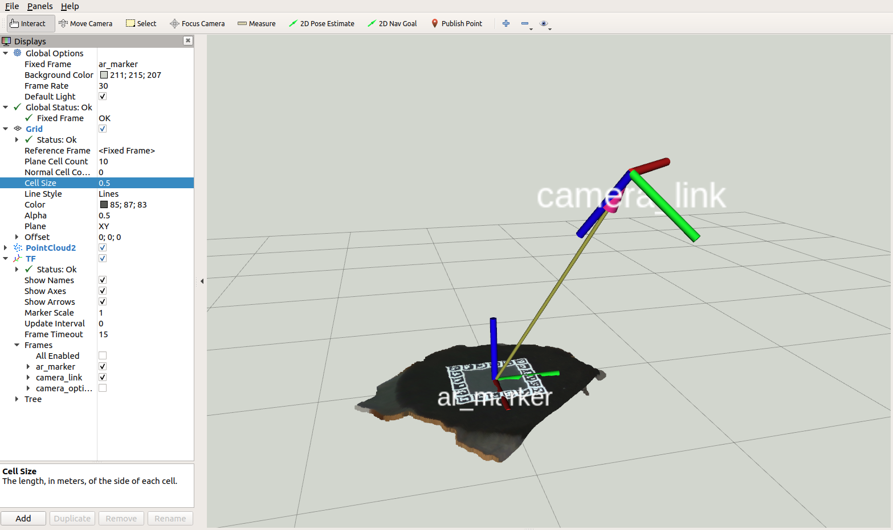

# Robotic Hand-eye Calibration Workspace 
| **`Ubuntu 1604 & ROS Kinetic Kame`** |  

This repo contains a eye-in-hand calibration tool (Cplusplus & ROS) in **JD京东 GRASPING ROBOT CHALLENGE ([News](http://me.sjtu.edu.cn/news/12692.html))**,   
and the implements of my paper: **Robotic hand-eye calibration with depth camera: A sphere model approach** (**[PDF](https://ieeexplore.ieee.org/document/8384652/)**)

Inside `/src` there are 5 ROS packages:    

* **rgbd_srv**   
used by camera_driver.  
* **camera_driver**  
drive Intel® RealSense™ RGBD cameras in ROS.   
(convert raw stream to ros `sensor_msgs::Image`)  
* **camera_transform_publisher**   
publish the transformation matrix (extrinsics) between camera and a marker( chessboard | aruco tag). 
* **handeye_calib_marker**  
handeye calib tools that use RGB camera and a marker, modified on [link](https://github.com/jhu-lcsr/handeye_calib_camodocal.git)   
**----------------------------------------------**   
with the package above you can calibrate the eye-in-hand transformation on RGB images.   

* **handeye_calib_sphere**  
fine-tune the eye-in-hand result based on depth.  


## Prerequisit
* Ubunutu 18.04 
* ROS Melodic Morenia (desktop-full install) 
* with OpenCV & Opencv_contrib install in `/usr/local` (both `3.4.0`)
* librealsense if you use **Intel® RealSense™** RGBD cameras (D400 series and the SR300)
* visp_hand2eye_calibration_calibrator  
`sudo apt-get install ros-melodic-visp-hand2eye-calibration`  
* glog at [here](https://github.com/google/glog/releases) (`0.4.0`)
* Ceres-solver download at [here](https://github.com/ceres-solver/ceres-solver/releases) (`1.14.0`) and instruction at [here](http://ceres-solver.org/installation.html) 
* Sophus at [here](https://github.com/strasdat/Sophus) (`1.0.0`)
* ros-melodic-cv-bridge *   
`sudo apt-get install ros-melodic-cv-bridge`


### Install opencv & opencv_contrib
Download [opencv](https://github.com/opencv/opencv/releases) and [opencv_contrib](https://github.com/opencv/opencv_contrib/releases) (both tested on `3.4.0`).   
Install opencv prerequisit:
```
[compiler] sudo apt-get install build-essential
[required] sudo apt-get install cmake git libgtk2.0-dev pkg-config libavcodec-dev libavformat-dev libswscale-dev
[optional] sudo apt-get install python-dev python-numpy libtbb2 libtbb-dev libjpeg-dev libpng-dev libtiff-dev libjasper-dev libdc1394-22-dev
```
Build opencv & opencv_contrib from source: (we turned off the cuda options)
```
mkdir build && cd build 
cmake \
    -D CMAKE_BUILD_TYPE=Release \
    -D OPENCV_EXTRA_MODULES_PATH= <path/to/opencv_contrib-3.4.0>/modules/ \
    -D BUILD_opencv_cudacodec=OFF \
    -D WITH_CUDA=OFF \
    -D WITH_CUBLAS=OFF \
    -D WITH_CUFFT=OFF \
    -D ENABLE_PRECOMPILED_HEADERS=OFF \
    -D CMAKE_INSTALL_PREFIX=/usr/local ..

make -j5
sudo make install
```

### Install librealsene (if you use Intel® RealSense™ RGBD Camera)
We use SR300/D415 camera and use `camera_driver` package to convert raw RGBD images into ROS topic: `sensor_msgs::Image`. The `librealsense` is required only if you use cameras from RealSense family, otherwise make your own `camera_driver`.

Following the librealsense installation guide at [here](https://github.com/IntelRealSense/librealsense/blob/master/doc/distribution_linux.md).  
We installed: `librealsense2-dkms librealsense2-utils librealsense2-dev librealsense2-dbg` 

### Install cv_bridge from source.

If you are lucky enough, the ros pre-build `ros-melodic-cv-bridge` works well.   
However, since the default OpenCV in `ros-melodic-cv-bridge` is `3.2`, while we use  opencv & opencv_contrib in `3.4.0`, we recommend you to build the cv_bridge from source.

```
git clone https://github.com/ros-perception/vision_opencv.git
cd vision_opencv
git checkout melodic
cd cv_bridge

mkdir build && cd build
cmake ..
make -j5
sudo make install
``` 

In the meantime, remove the pre-bulid `cv_bridge` in ros-melodic path `/opt/ros/melodic`:  
```
cd /opt/ros/melodic

# (or you can move it to other place)
sudo rm -rf lib/libcv_bridge.so
sudo rm -rf include/cv_bridge
sudo rm -rf share/cv_bridge
```  

For more informations about `cv_bridge`, see [here](http://wiki.ros.org/cv_bridge).


## Build 
```
git clone https://github.com/lixiny/Handeye-Calibration-ROS.git
cd Handeye-Calibration-ROS  
catkin_make
```  

if you only want to calibrate hand-eye transformation on RGB, 
```
git clone https://github.com/lixiny/Handeye-Calibration-ROS.git  
cd Handeye-Calibration-ROS  
git checkout rgb_only
catkin_make
```    


## Ready to Use (Example on RealSense D415 & UR5)

### 0. Robot and camera setup. 

 


cd into the `Handeye-Calibration-ROS/` folder,
### 1. Pluged in D415 camera, run:   
```
roslaunch camera_driver realsense_driver.launch
```  
The camera intrinsic will appear in current terminal, record it (later we call it `CamIntr`).     
    

The `camera_driver` publishes 3 topics to rosmaster: 
* /realsense/rgb
* /realsense/depth
* /realsense/cloud  

You can also visualize the topic in `rviz`. 

### 2. Prepare a marker.
You can either use a chessboard or an aruco plane (`doc/aruco_plane.jpg`) we designed.   

### 3. Publish a transformation between camera and marker.   

[**IMPORTANT**] Make sure that you have put the `CamIntr` in file: `camera_transform_publisher/camera_intrinsic.xml`.  

#### :smile: Chessboard 
After you placed the chessboard inside camera view, run: 
```
roslaunch camera_transform_publisher chessboard_publisher_realsense.launch
``` 
[**IMPORTANT**] There are three user-specified parameters in `chessboard_publisher_realsense.launch`: 
* chessboardWidth -- # of inner corners on chessboard width direction
* chessboardHeight -- # of inner corners on chessboard height direction
* squareSize -- length of side of each square on chessboard, in meter.    

Make sure you have already modified them based on your chessboard. 

#### :grin: Aruco Plane
After you placed our aruco plane inside camera view, run: 
```
roslaunch camera_transform_publisher aruco_publisher_realsense.launch
``` 
[**IMPORTANT**] There are two user-specified parameters in `aruco_publisher_realsense.launch`: 
* tagSideLen -- side length of a single aruco tag, in meter. (see illustration)
* planeSideLen -- side length of the whole aruco plane, in meter.(see illustration)

Make sure you have already modified them based on the physical length of your aruco plane.

Now in the pop-up window, you will see an AR cube. you can also visualize `tf`(camera_link, ar_marker)  in `rviz`   
     


## Related Publications:    

Yang, Lixin, et al. " **Robotic hand-eye calibration with depth camera: A sphere model approach.** " 2018 4th International Conference on Control, Automation and Robotics (ICCAR). IEEE, 2018. **[PDF](https://ieeexplore.ieee.org/document/8384652/)**

    @inproceedings{yang2018robotic,
      title={Robotic hand-eye calibration with depth camera: A sphere model approach},
      author={Yang, Lixin and Cao, Qixin and Lin, Minjie and Zhang, Haoruo and Ma, Zhuoming},
      booktitle={2018 4th International Conference on Control, Automation and Robotics (ICCAR)},
      pages={104--110},
      year={2018},
      organization={IEEE}
    }


## License
handeyeCalibWithDepthCamera is freely available for free non-commercial use, and may be redistributed under these conditions. Please, see the [license](LICENSE) for further details