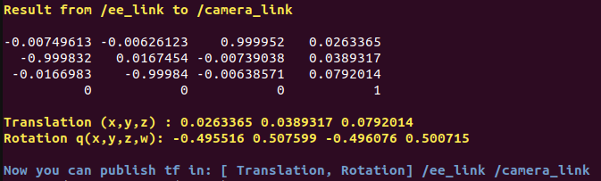
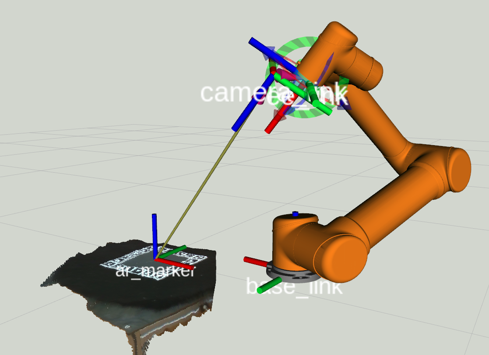

# Robotic Hand-eye Calibration Workspace 
| **`Ubuntu 1804 & ROS Melodic Morenia`** |  

This repo contains a eye-in-hand calibration tool (Cplusplus & ROS) in **JD京东 GRASPING ROBOT CHALLENGE ([News](http://me.sjtu.edu.cn/news/12692.html))**,   
and the implements of my paper: **Robotic hand-eye calibration with depth camera: A sphere model approach** (**[PDF](https://ieeexplore.ieee.org/document/8384652/)**)

Inside `/src` there are 5 ROS packages:    

* **rgbd_srv**   
used by camera_driver.  
* **camera_driver**  
drive Intel® RealSense™ RGBD cameras in ROS.   
(convert raw stream to ros `sensor_msgs::Image`)  
* **camera_transform_publisher**   
publish the transformation matrix (extrinsics) between camera and a marker( chessboard | [aruco](https://docs.opencv.org/trunk/d5/dae/tutorial_aruco_detection.html) tag). 
* **handeye_calib_marker**  
handeye calib tools that use RGB camera and a marker, modified from [handeye_calib_camodocal](https://github.com/jhu-lcsr/handeye_calib_camodocal.git)   
**----------------------------------------------**   
with the package above you can calibrate the eye-in-hand transformation on RGB images.   

* **handeye_calib_sphere**  
fine-tune the eye-in-hand result based on depth.  


## Prerequisit
* Ubunutu 18.04 
* ROS Melodic Morenia (desktop-full install) 
* with OpenCV & Opencv_contrib install in `/usr/local` (both `3.4.0`)
* librealsense if you use **Intel® RealSense™** RGBD cameras (D400 series and the SR300)
* visp_hand2eye_calibration_calibrator  
`$ sudo apt-get install ros-melodic-visp-hand2eye-calibration`  
* glog at [here](https://github.com/google/glog/releases) (`0.4.0`)
* Ceres-solver download at [here](https://github.com/ceres-solver/ceres-solver/releases) (`1.14.0`) and instruction at [here](http://ceres-solver.org/installation.html) 
* Sophus at [here](https://github.com/strasdat/Sophus) (`1.0.0`)
* ros-melodic-cv-bridge *   
`$ sudo apt-get install ros-melodic-cv-bridge`
* Point Cloud Library ([PCL](https://pointclouds.org/))   
`$ sudo apt-get install libpcl-dev ros-melodic-pcl-ros`  
 


### Install opencv & opencv_contrib
Download [opencv](https://github.com/opencv/opencv/releases) and [opencv_contrib](https://github.com/opencv/opencv_contrib/releases) (both tested on `3.4.0`).   
Install opencv prerequisit:
```bash
[compiler] $ sudo apt-get install build-essential
[required] $ sudo apt-get install cmake git libgtk2.0-dev pkg-config libavcodec-dev libavformat-dev libswscale-dev
[optional] $ sudo apt-get install python-dev python-numpy libtbb2 libtbb-dev libjpeg-dev libpng-dev libtiff-dev libjasper-dev libdc1394-22-dev
```
Build opencv & opencv_contrib from source: (we turned off the cuda options)
```bash
$ mkdir build && cd build 
$ cmake \
    -D CMAKE_BUILD_TYPE=Release \
    -D OPENCV_EXTRA_MODULES_PATH= <path/to/opencv_contrib-3.4.0>/modules/ \
    -D BUILD_opencv_cudacodec=OFF \
    -D WITH_CUDA=OFF \
    -D WITH_CUBLAS=OFF \
    -D WITH_CUFFT=OFF \
    -D ENABLE_PRECOMPILED_HEADERS=OFF \
    -D CMAKE_INSTALL_PREFIX=/usr/local ..

$ make -j5
$ sudo make install
```

### Install librealsene (if you use Intel® RealSense™ RGBD Camera)
We use SR300/D415 camera and use `camera_driver` package to convert raw RGBD images into ROS topic of `sensor_msgs::Image`. The `librealsense` is required only if you use cameras from RealSense™ family, otherwise make your own `camera_driver`.

Following the librealsense installation guide at [here](https://github.com/IntelRealSense/librealsense/blob/master/doc/distribution_linux.md).  
We installed: `librealsense2-dkms`,  `librealsense2-utils`, `librealsense2-dev`,  `librealsense2-dbg` 

### Install cv_bridge from source.

If you are lucky enough, the ros pre-build `ros-melodic-cv-bridge` works well.   
However, since the default OpenCV in `ros-melodic-cv-bridge` is `3.2`, while we use  opencv & opencv_contrib in `3.4.0`, we recommend you to build the cv_bridge from source.

```bash
$ git clone https://github.com/ros-perception/vision_opencv.git
$ cd vision_opencv
$ git checkout melodic
$ cd cv_bridge

$ mkdir build && cd build
$ cmake ..
$ make -j5
$ sudo make install
``` 

In the meantime, remove the pre-bulid `cv_bridge` in ros-melodic path `/opt/ros/melodic`:  
```bash
$ cd /opt/ros/melodic

# or you can archive them to other place
$ sudo rm -rf lib/libcv_bridge.so
$ sudo rm -rf include/cv_bridge
$ sudo rm -rf share/cv_bridge
```  

For more information about `cv_bridge`, see [here](http://wiki.ros.org/cv_bridge).


## Build 
```bash
$ git clone https://github.com/lixiny/Handeye-Calibration-ROS.git
$ cd Handeye-Calibration-ROS  
$ catkin_make
```  

if you only want to calibrate hand-eye transformation on RGB marker, 
```bash
$ git clone https://github.com/lixiny/Handeye-Calibration-ROS.git  
$ cd Handeye-Calibration-ROS  
$ git checkout rgb_only
$ catkin_make
```    


## Ready to Use (Example on RealSense D415 & UR5)

### 0. Robot and Camera Setup 


cd into the `Handeye-Calibration-ROS/` folder, and source `devel/setup.bash` in each new terminal.
### 1. Pluged in Camera, Bringup RealSense   
```bash
$1 roslaunch camera_driver realsense_driver.launch
```  
The camera intrinsic will appear in current terminal, record it (later we call it `CamIntr`).     
    

The `camera_driver` publishes 3 topics to rosmaster: 
* /realsense/rgb
* /realsense/depth
* /realsense/cloud   
(the point cloud is under tf frame: `/camera_link`)

You can also visualize these topics in `rviz`. 

### 2. Prepare a Marker
You can either use a chessboard or an aruco plane at [doc/rawArucoPlane.jpg](./doc/rawArucoPlane.jpg) we designed.   

### 3. Publish the Transformation (tf) Between Camera and Marker   

[**IMPORTANT**] Make sure that you have put the `CamIntr` in file: `camera_transform_publisher/camera_intrinsic.xml`.  

#### :smile:  Chessboard 
After you placed the chessboard inside camera view, run: 
```bash
$2 roslaunch camera_transform_publisher chessboard_publisher_realsense.launch
``` 
[**IMPORTANT**] There are 3 user-specified parameters in `chessboard_publisher_realsense.launch`: 
* chessboardWidth -- # of inner corners on chessboard width direction
* chessboardHeight -- # of inner corners on chessboard height direction
* squareSize -- length of side of each square on chessboard, in meter.    

Make sure you have already modified them based on your chessboard. 

#### :wink:  Aruco Plane
After you placed our aruco plane inside camera view, run: 
```bash
$2 roslaunch camera_transform_publisher aruco_publisher_realsense.launch
``` 
[**IMPORTANT**] There are 2 user-specified parameters in `aruco_publisher_realsense.launch`: 
* tagSideLen -- side length of a single aruco tag, in meter. (see illustration)
* planeSideLen -- side length of the whole aruco plane, in meter.(see illustration)

Make sure you have already modified them based on the physical length of your aruco plane.

Now in the pop-up window, you will see an AR cube.   
     

This `camera_transform_publisher` will publish a tf (`/camera_link`,  `/ar_marker`) to ros master. If no marker found, a Identity SE3 tf will be used.  You can also visualize the two frame in rviz.

### 4. Bringup UR

Followed the instrction #3. **Bringup UR** in [doc/install_ur.md](./doc/install_ur.md).

### 5. Perform Hand-eye Calibration on Marker
```bash
$3 roslaunch handeye_calib_marker handeye_online.launch
```
[**IMPORTANT**] There are 4 user-specified parameters in `handeye_online.launch`: 

* ARTagTF -- the name of marker frame (defined in `camera_transform_publisher`, `/ar_marker`)
* cameraTF -- the name of camera frame (defined in `camera_transform_publisher`, `/camera_link`)
* EETF -- the name of End Effector frame (defined by UR, `/ee_link`)
* baseTF -- the name of robot base frame (defined by UR, `base_link`)  

Check these 4 tf names before you launch calibraion!

#### start calibration

Repeatedly move UR end effector to different configuration. Meanwhile, make sure at each unique ee config, a valid marker can be detected. In current terminal, press `s` to record one `AX=XB` equation. After sufficient # of equations have been recorded (30+), press `q` to perform calibraition. Then in current terminal, you will see some output like:   



#### publish the results  
modify the file: `handeye_calib_marker/launch/show_result.launch`, 
replace the `$Translation(xyz)` and `$Rotationq(xyzw)` based on your terminal output.   
```xml
<launch>
  <node pkg="tf" 
        type="static_transform_publisher" 
        name="realsense_link" 
        args="$Translation(xyz) 
              $Rotationq(xyzw)
              /ee_link 
              /camera_link 
              100"
  />
</launch>
``` 
and launch:
```bash
$4 roslaunch handeye_calib_marker show_result.launch 
```
or, in a new terminal: 
```bash
# rosrun tf static_transform_publisher \
#           x y z qx qy qz qw \
#           frame_id  child_frame_id  period_in_ms

$4 rosrun tf static_transform_publisher ＼
        0.0263365 0.0389317 0.0792014 -0.495516 0.507599 -0.496076 0.500715 \
        /ee_link   /camera_link   100
```

#### visualize in rviz



There are several representations / expressions of the HAND-EYE problem:  
* HAND-EYE is the transformation from `/ee_link` to `/camera_link`  
* or the tf: (`/ee_link`,  `/camera_link`)  
* or father: `/ee_link`,  child: `/camera_link`   
* or $P_{ee_link} = T_{handeye} * P_{camera_link}$  


**NOTE**: now you should have a ready-to-use handeye transformation.  
This results is optimized only from RGB images. You can still fine-tune the result based on depth image (if has).  

### 6. (Optional) Fine-tune on Sphere

// TODO


## Related Publications:    

Yang, Lixin, et al. " **Robotic hand-eye calibration with depth camera: A sphere model approach.** " 2018 4th International Conference on Control, Automation and Robotics (ICCAR). IEEE, 2018. **[PDF](https://ieeexplore.ieee.org/document/8384652/)**

    @inproceedings{yang2018robotic,
      title={Robotic hand-eye calibration with depth camera: A sphere model approach},
      author={Yang, Lixin and Cao, Qixin and Lin, Minjie and Zhang, Haoruo and Ma, Zhuoming},
      booktitle={2018 4th International Conference on Control, Automation and Robotics (ICCAR)},
      pages={104--110},
      year={2018},
      organization={IEEE}
    }


## License
handeyeCalibWithDepthCamera is freely available for free non-commercial use, and may be redistributed under these conditions. Please, see the [license](LICENSE) for further details